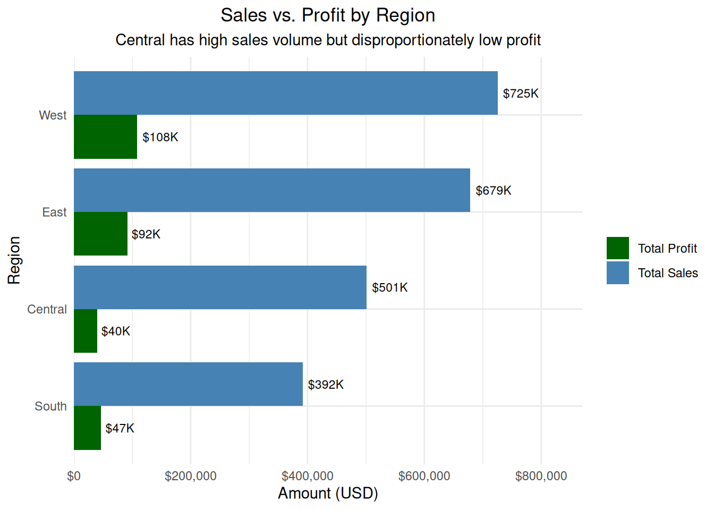
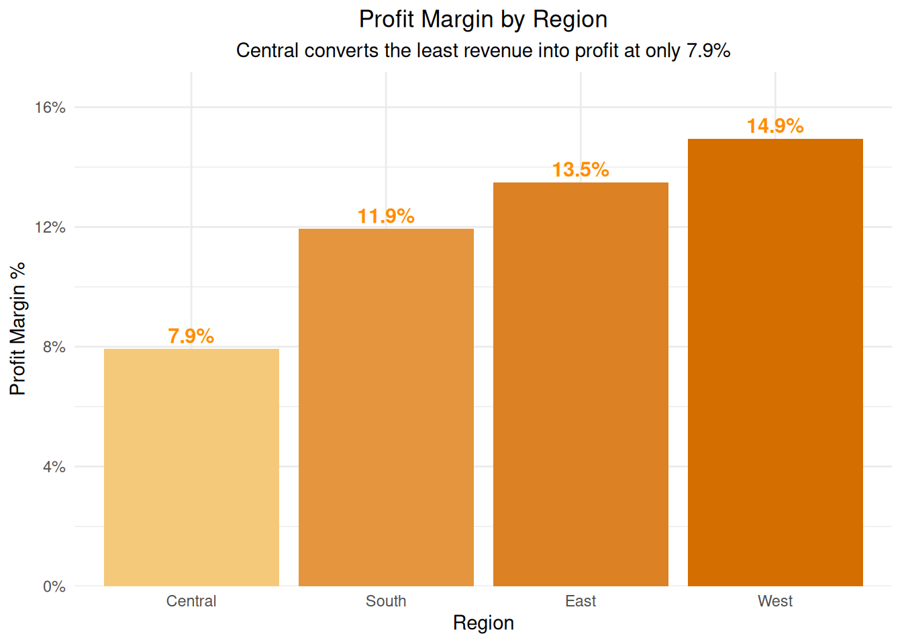
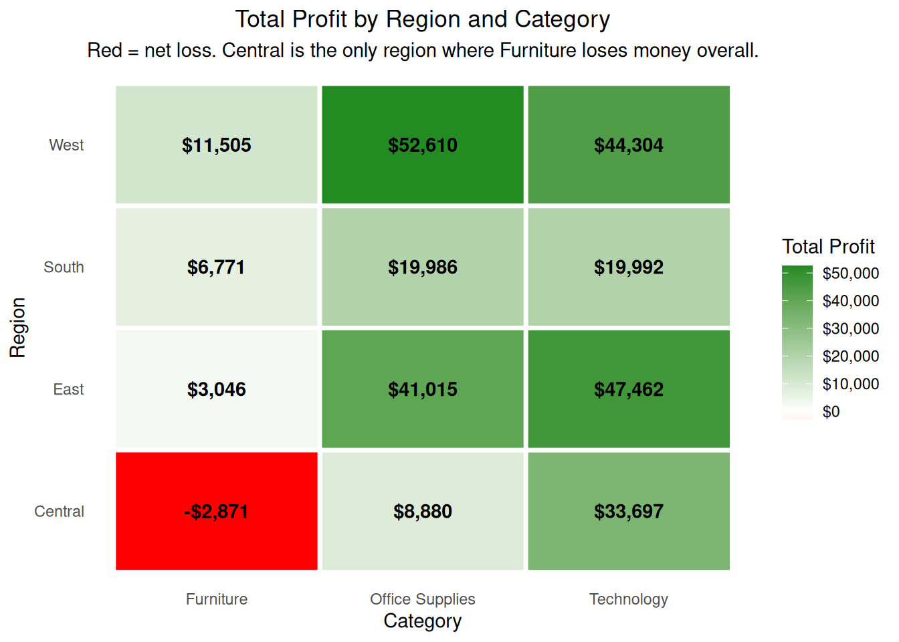
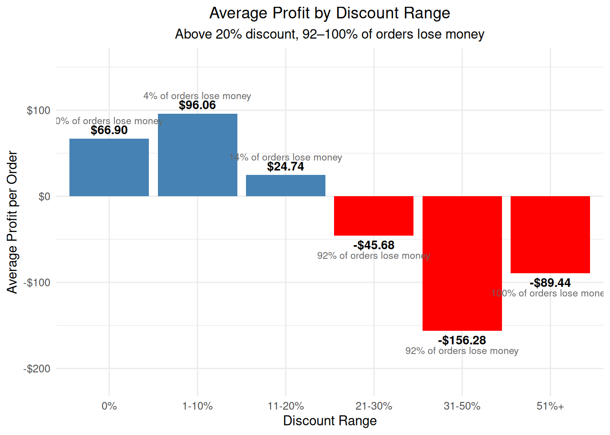
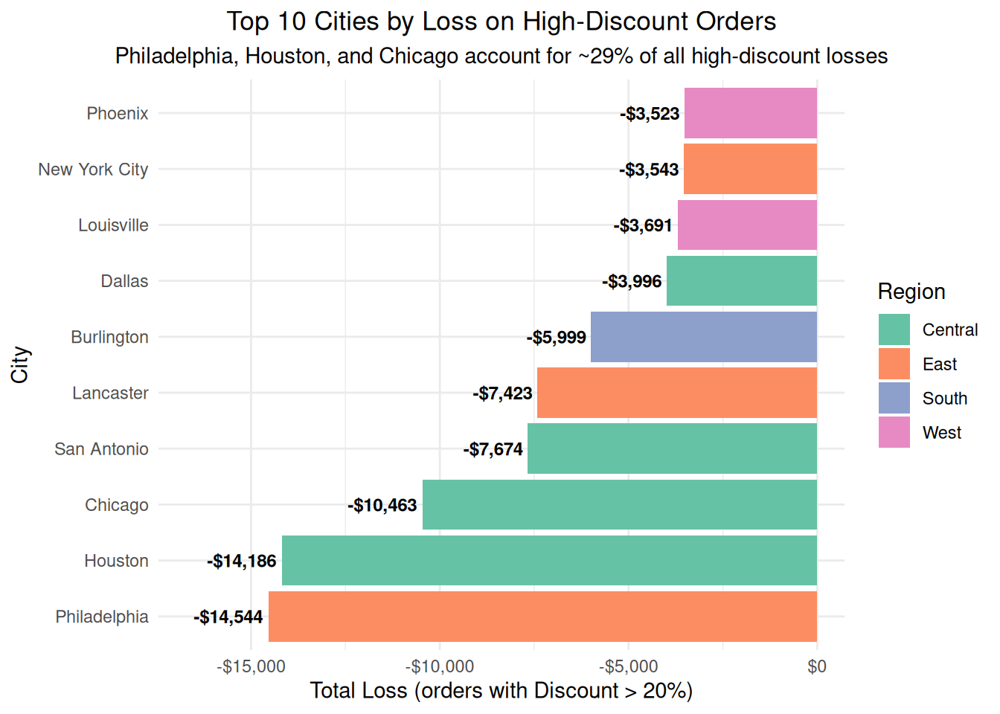
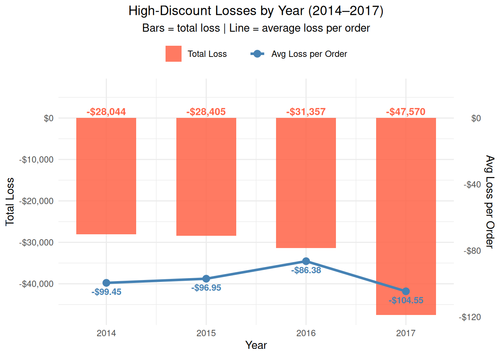
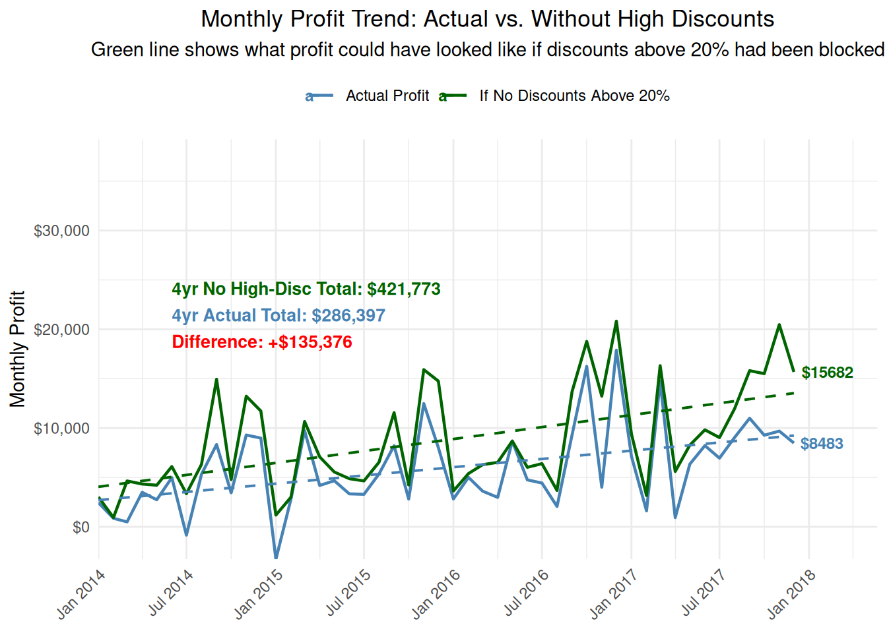
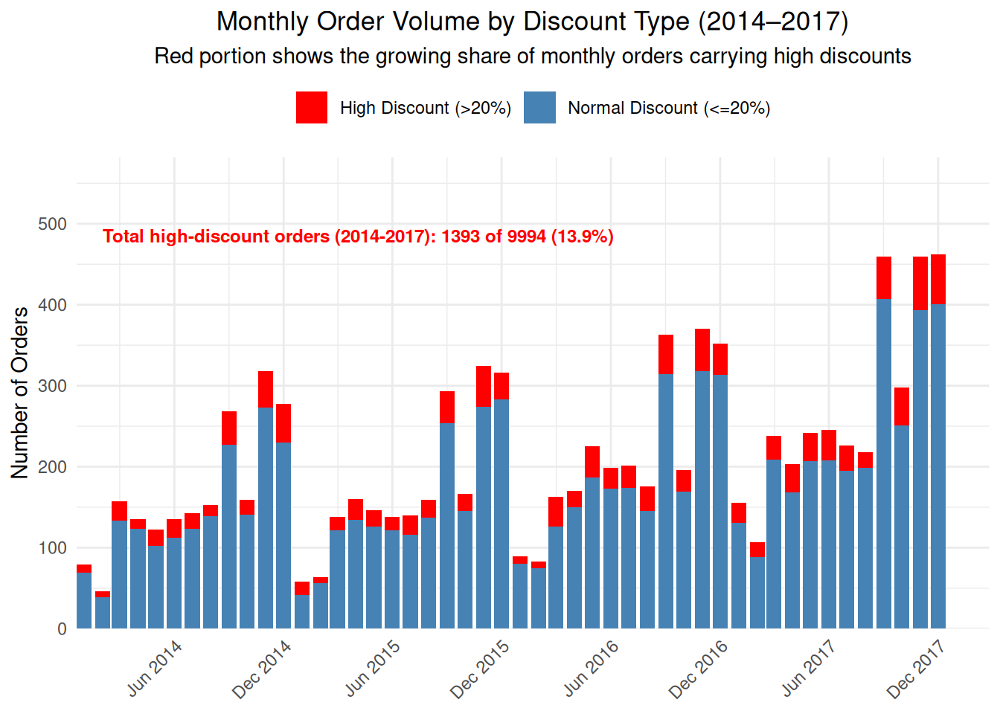

Sample Superstore Profit Loss Analysis
This is an R project that digs into where a retail company is losing money and what is causing it. The dataset covers 9,994 orders placed between 2014 and 2017, and the analysis works through cleaning, statistics, regression, and visualization to tell a clear story about what is hurting profitability.
The short version — discounts above 20% lose money 97% of the time, and over four years that quietly cost the business $135,376. Central region and three cities, Philadelphia, Houston, and Chicago, are responsible for most of the damage.
Dataset from Kaggle: https://www.kaggle.com/datasets/vivek468/superstore-dataset-final
To run it, download the dataset and place it in the same folder as Final_Project.Rmd, then open it in RStudio or Posit Cloud and knit to HTML.

Visualizations
Sales vs Profit by Region

Profit Margin by Region

Total Profit by Region and Category

Average Profit by Discount Level

Top 10 Cities With Negative Profit on High Discount Orders

High Discount Losses by Year

Monthly Profit Trend

Monthly Order Volume by Discount Type

Key Findings
Discounts above 20% lose money 96.8% of the time and generated a net loss of $135,376 over four years while only representing 13.9% of all orders.
Central region has the lowest profit margin at 7.9% and is the only region where Furniture runs at a net loss. Four of the ten worst cities for losses are in Central, Houston, Chicago, San Antonio, and Dallas.
Philadelphia and Houston each exceed $14,000 in losses from high discount orders alone.
High discount order volume nearly doubled from 2014 to 2017. The average loss per order stayed flat, meaning the problem is how often discounts are issued, not how large they are.

Author: Amon Santos
